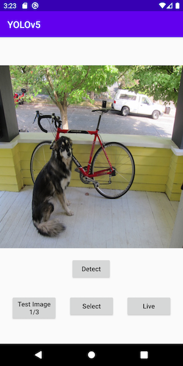
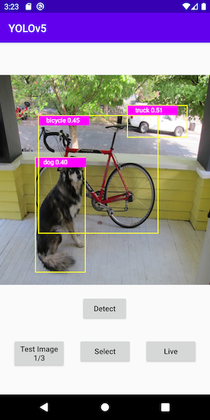
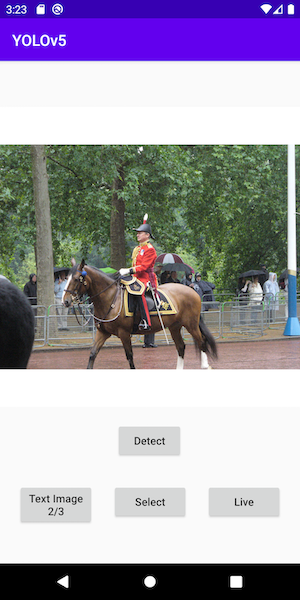
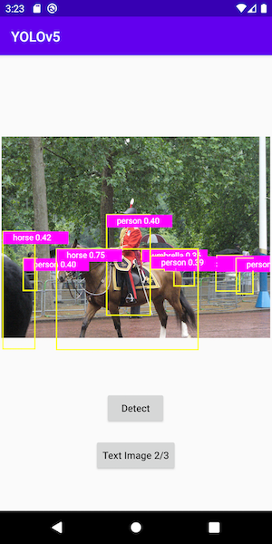
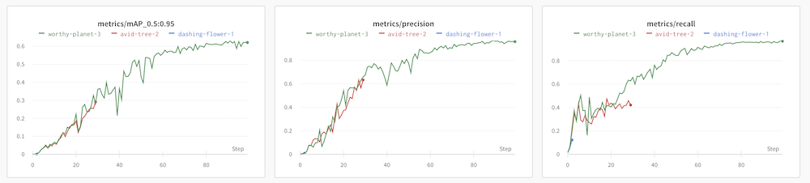
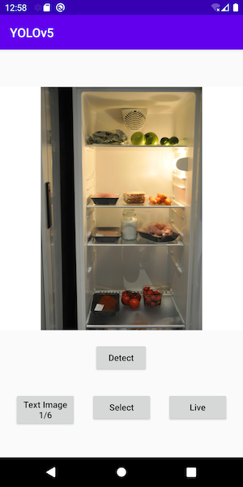
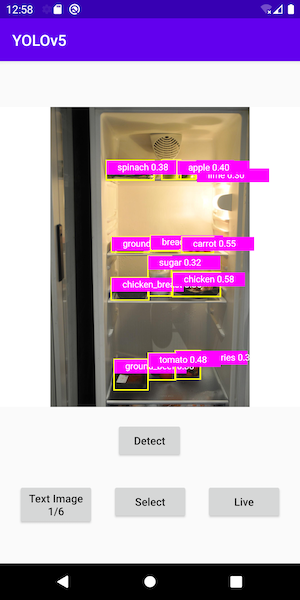
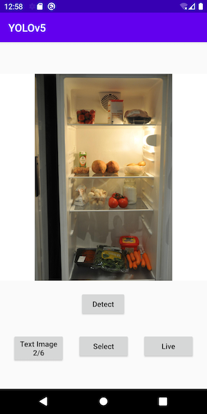
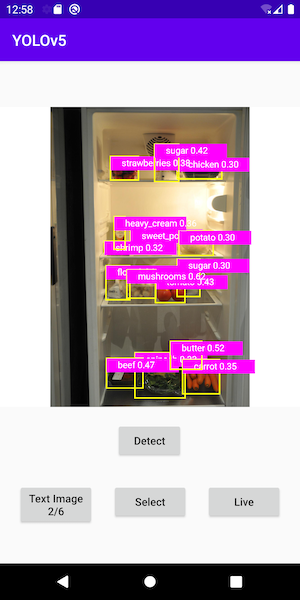

# Android에서 YOLOv5를 사용한 객체 탐지

## 소개하기

[YOLO](https://pjreddie.com/darknet/yolo/) (You Only Look Once)는 가장 빠르고 인기 있는 객체 팀지 모델 중 하나입니다. [YOLOv5](https://github.com/ultralytics/yolov5)는 오픈 소스로 구현된 YOLO 최신 버전입니다(추론을 위해 PyTorch 허브에서 YOLOv5를 로드하는 빠른 테스트는 [여기](https://pytorch.org/hub/ultralytics_yolov5/#load-from-pytorch-hub) 참조). Object Detection with YOLOv5 Android 샘플 앱은 스크립트화된 PyTorch YOLOv5 모델을 사용하여 훈련된 [80개 클래스](https://github.com/ultralytics/yolov5/blob/master/data/coco.yaml)의 객체를 감지합니다.

**2021년 9월 30일 업데이트**: YOLOv5 모델(전이 학습이라고도 함)을 미세 조정(fine-tune)하기 위해 사용자 지정 데이터 세트를 사용하는 섹션과 사용자 지정 모델을 사용하도록 Android 프로젝트를 변경하는 단계가 추가되었습니다.

## 전제조건

* PyTorch 1.10.0 and torchvision 0.11.1 (Optional)
* Python 3.8 (Optional)
* Android Pytorch library pytorch_android_lite:1.10.0, pytorch_android_torchvision_lite:1.10.0
* Android Studio 4.0.1 or later

## 빠른 시작

Object Detection Android 앱을 실행하기 위해 다음 단계가 필요합니다.

### 1. 모델 준비하기

PyTorch의 스크립트를 실행하는 환경을 설정하지 않은 경우 모델 파일 `yolov5s.torchscript.ptl`을 [여기](https://pytorch-mobile-demo-apps.s3.us-east-2.amazonaws.com/yolov5s.torchscript.ptl) 에서 다운로드할 수 있습니다. 다운로드받은 모델 파일을 `android-demo-app/ObjectDetection/app/src/main/assets` 폴더에 넣은 다음, 이 단계의 나머지 부분을 건너뛰고 2단계로 바로 이동하시면 됩니다.

[YOLOv5 repo](https://github.com/ultralytics/yolov5)의 `models` 폴더에 있는 Python 스크립트 `export.py`는 모바일 앱용 `yolov5s.torchscript.pt`라는 TorchScript 형식의 YOLOv5 모델을 생성하는 데 사용됩니다.

Mac/Linux/Windows 터미널을 열고 다음 명령을 실행합니다(코드 변경 사항이 작동하는지 확인하기 위해 원본 YOLOv5 저장소의 포크를 사용하지만, 원본 저장소 자체 자유롭게 사용할 수 있음).

```
git clone https://github.com/ultralytics/yolov5
cd yolov5j
pip install -r requirements.txt wanb
```

아래 단계는 `cd35a009ba964331abccd30f6fa0614224105d39` 커밋으로 테스트되었으며, 스크립트 실행 또는 모델 사용에 문제가 있으면 `git reset --hard cd35a009ba964331abccd30f6fa0614224105d39`를 시도하십시오.

`export.py` 파일에서 아래의 두 가지를 변경합니다.

* `f = file.with_suffix('.torchscript.pt')` 뒤에 `fl = file.with_suffix('.torchscript.ptl')` 추가

* `(optimize_for_mobile(ts) if optimize else ts).save(f)` 뒤에 `(optimize_for_mobile(ts) if optimize else ts)._save_for_lite_interpreter(str(fl))` 추가

이제 아래 스크립트를 실행하여 최적화된 TorchScript lite 모델 `yolov5s.torchscript.ptl`을 생성하고 `android-demo-app/ObjectDetection/app/src/main/assets` 폴더에 복사합니다(비교를 위해 원래 전체 JIT 모델 `yolov5s.torchscript.pt`도 같이 생성됩니다.)

```
python export.py --weights yolov5s.pt --include torchscript
```

기본적으로 `export.py`를 실행하면 더 빠르게 실행되지만, 정확도가 떨어지는 작은 크기의 YOLOv5 모델이 생성됩니다. 또한 `export.py`에서 `weights` 매개변수의 값을 변경하여 중형, 대형 및 초대형 버전 모델을 생성할 수도 있습니다.

### 2. Android Studio에서 빌드하기

Android Studio를 실행해서 `android-demo-app/ObjectDetection`에 있는 프로젝트를 엽니다. 앱의 `build.gradle` 파일에는 다음 코드 라인이 있는 것에 주목하세요.

```
implementation 'org.pytorch:pytorch_android_lite:1.10.0'
implementation 'org.pytorch:pytorch_android_torchvision_lite:1.10.0'
```

### 3. 앱 실행하기

앱을 실행할 Android 에뮬레이터 또는 실제 기기를 선택하세요. 포함된 테스트 이미지로 탐지 결과를 확인할 수 있습니다. Android 기기의 사진 라이브러리에서 사진을 선택하거나, 기기 카메라로 사진을 찍거나, 라이브 카메라를 사용하여 객체 탐지를 수행할 수도 있습니다. - 스크린캐스트로 실행 중인 [영상](https://drive.google.com/file/d/1-5AoRONUqZPZByM-fy0m7r8Ct11OnlIT/view)도 확인하세요.

아래는 예제 이미지 및 객체 탐지 결과입니다.







## 전이 학습

이 섹션에서는 [aicook](https://universe.roboflow.com/karel-cornelis-q2qqg/aicook-lcv4d/4)이라는 냉장고의 재료를 감지하는 데 사용되는 예제 데이터 세트를 사용하여 YOLOv5 모델을 미세 조정하는 방법을 보여줍니다. YOLOv5 전이 학습에 대한 자세한 내용은 [여기](https:github.comultralyticsyolov5issues1314)를 참조하세요. 기본 YOLOv5 모델을 사용하여 냉장고 내부의 물체 감지를 수행하면 좋은 결과를 얻지 못할 수 있습니다. 이런 이유로 aicook과 같은 데이터 세트로 훈련된 사용자 지정 모델이 필요한 이유입니다.

### 1. 사용자 지정 데이터 세트 다운로드

[여기](https://universe.roboflow.com/karel-cornelis-q2qqg/aicook-lcv4d/4)로 이동하여 zip 파일로 된 aicook 데이터 세트를 다운로드합니다. 파일의 압축을 `yolov5` 저장소 디렉토리에 풀고 `cd yolov5; mv train ..; mv valid ..;`를 실행하여 `train` 및 `val` 폴더를 aicook `data.yaml`의 한 수준 위의 폴더로 이동합니다.

### 2. 사용자 정의 데이터 세트로 YOLOv5 재학습하기

`runs/train/exp/weights`에 사용자 지정 모델 `best.torchscript.pt`을 생성하기 위해 아래의 스크립트를 실행합니다.

```
python train.py --img 640 --batch 16 --epochs 3 --data  data.yaml  --weights yolov5s.pt
```

epoch가 3으로 설정된 모델의 정밀도는 실제로 0.01 미만으로 매우 낮습니다. YOLOv5와 통합되어 있으며 몇 분 안에 설정할 수 있는 [Weights and Biases](https://wandb.ai)와 같은 도구를 사용하면 `--epochs`를 80으로 설정하여 정밀도를 0.95까지 올릴 수 있습니다. 그러나 CPU 머신에서는 위의 명령을 사용하여 사용자 지정 모델을 빠르게 학습시킨 다음, Android 데모 앱에서 테스트할 수 있습니다. 다음은 epoch이 3, 30 및 100으로 학습시켰을 때의 샘플 wandb 메트릭입니다.



### 3. 사용자 지정 모델을 lite 버전으로 변환하기

`빠른 시작` 섹션의 1단계 `모델 준비하기`에서 수정된 `export.py`를 사용하여 새 사용자 지정 모델을 TorchScript lite 버전으로 변환할 수 있습니다.

```
python export.py --weights runs/train/exp/weights/best.pt --include torchscript
```

결과로 생성된 모델 `best.torchscript.ptl`은 `runstrainexpweights`에 위치해 있습니다. 이 파일을 Android 데모 앱의 assets 폴더에 복사해야 합니다.

### 4. 데모 앱 업데이트하기

먼저 Android Studio에서 `MainActivity.java`의 아래 라인들을 변경합니다.

```
private String[] mTestImages = {"test1.png", "test2.jpg", "test3.png"};
```
아래와 같이 변경합니다.
```
private String[] mTestImages = {"aicook1.jpg", "aicook2.jpg", "aicook3.jpg", "test1.png", "test2.jpg", "test3.png"};
```
(3개의 aicook 테스트 이미지가 repo에 추가되어 있습니다.)

아래 라인들도
```
mModule = LiteModuleLoader.load(MainActivity.assetFilePath(getApplicationContext(), "yolov5s.torchscript.ptl"));
BufferedReader br = new BufferedReader(new InputStreamReader(getAssets().open("classes.txt")));
```
아래와 같이 변경합니다.
```
mModule = LiteModuleLoader.load(MainActivity.assetFilePath(getApplicationContext(), "best.torchscript.ptl"));
BufferedReader br = new BufferedReader(new InputStreamReader(getAssets().open("aicook.txt")));
```
(aicook.txt는 1단계에서 다운로드한 사용자 정의 데이터 세트의 `data.yaml`에서 복사한 30개의 사용자 정의 클래스 이름을 정의합니다.)

그런 다음 `PrePostProcessor.java`에서 `private static int mOutputColumn = 85;` 행을 `private static int mOutputColumn = 35;`로 변경합니다.

Android Studio에서 앱을 실행하면 aicook 테스트 이미지 첫 세 장에서 작동하는 사용자 정의 모델이 표시되어야 합니다.







새로운 사용자 정의 모델로 라이브 객체 탐지를 수행하려면, `ObjectDetectionActivity.java`를 열고 `mModule = LiteModuleLoader.load(MainActivity.assetFilePath(getApplicationContext(), "yolov5s.torchscript.ptl"));`의 `yolov5s.torchscript.ptl`를 `best.torchscript.ptl`으로 변경합니다.
